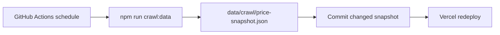
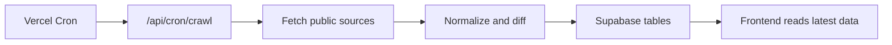

# 自动化爬取方案

## 当前最小方案

第一阶段用 GitHub Actions 每天 20:20（Asia/Shanghai）运行 `npm run crawl:data`，把公开页面抽取结果写入 `data/crawl/price-snapshot.json`，如果文件有变化就自动提交回仓库。Vercel 绑定仓库后会随提交重新部署，因此不需要数据库、队列或额外服务器。

这个方案的好处是部署成本最低、可回滚、每次数据变化都有 Git 记录。限制是它只适合低频公开页面采集，不适合高频、登录态、需要代理池或大量动态页面的采集。

## 后续升级

接入 Supabase 后，可以改成 Vercel Cron 请求一个 Next.js Route Handler，由服务端函数抓取并写入数据库。这样页面可以按数据库更新时间渲染，也可以保留价格历史、变动通知和后台人工复核。

## 采集边界

只抓公开官方页面，保留来源链接和复核时间。不做登录态采集、不绕过验证码、不绕过付费墙，也不使用灰色代充来源。遇到 `403` 或内容保护时保留失败记录，改用人工复核或官方可访问文档源。
